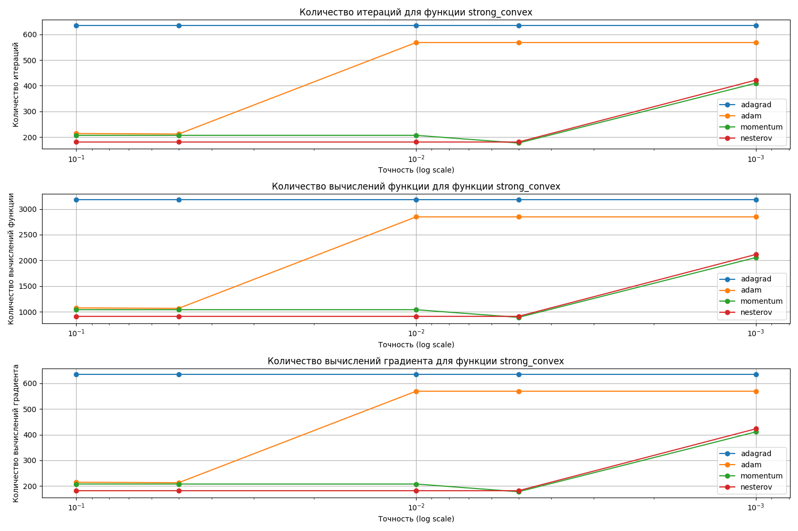

# Лабораторная работа 3: Модификации градиентного спуска

### 1. Реализованные методы
В ходе лабораторной работы были реализованы и исследованы следующие методы:
*   (a) Метод Momentum
*   (b) Метод Nesterov
*   (c) Метод AdaGrad
*   (d) Метод AdaDelta
*   (e) Метод RMSProp
*   (f) Метод Adam

### 2. Тестовые функции
Для исследования были рассмотрены следующие функции:

*   **Квадратичная (`f1_quadratic`):** $f(x, y) = x^2 + 0.5xy + y^2 - 3x + 4y + 1$
*   **Плохо обусловленная (`f2_strong_convex`):** $f(x, y) = x^2 + 100y^2 - 3x + 4y + 1$
*   **Функция Розенброка (`f3_rosenbrock`):** $f(x, y) = (1 - x)^2 + 100(y - x^2)^2$

---

### 3. Сравнение производительности методов

Для каждой функции были построены графики сравнения производительности, исходя из следующих вводных:
*   Начальная точка `x0 = [0.0, 0.0]`
*   Шаги итерации `step_sizes = [0.1, 0.05, 0.01, 0.005, 0.001]`

Результаты (таблицы для каждого метода) сохранены в CSV-файлы в папке `results`.

#### Графики зависимости производительности от шага (точности)

**Функция `quadratic`**

**Функция `strong_convex`**

**Функция `rosenbrock`**

Согласно графикам, на простой квадратичной функции почти все методы находят локальный минимум. На более сложной, плохо обусловленной функции `f2`, справились только **Adagrad, Momentum, Nesterov и Adam**. На невыпуклой ("банановидной") функции Розенброка справился только метод **Adam**.

---

### 4. Анализ траекторий на функции Розенброка

Для функции Розенброка были построены и сравнены траектории каждого метода на графике линий уровня.

Результаты для шага `step_size=0.01`:

| Метод | Статус | Итераций |
| :--- | :---: | :---: |
| Adam* | Успешно | 638 |
| Momentum | Не сошелся | 24 |
| Nesterov | Не сошелся | 10 |
| Adagrad | Не сошелся | 1000 |
| AdaDelta | Не сошелся | 1000 |
| RMSProp | Не сошелся | 1000 |

 На функции Розенброка только Adam смог успешно сойтись к глобальному минимуму, демонстрируя высокую эффективность при работе со сложными ландшафтами. Остальные методы либо не сошлись, либо достигли максимального числа итераций без достижения цели.

---

### 5. Зависимость от размерности и числа обусловленности

Был реализован генератор квадратичных функций (`generate_quadratic_function`) заданной размерности и числа обусловленности. С его помощью была рассмотрена зависимость числа итераций от этих параметров для метода Adam и метода сопряженных градиентов.

**Вывод:** По графику можно сделать вывод, что **метод Adam** отлично справляется на квадратичных функциях, так как его производительность практически не зависит от размерности и числа обусловленности, в отличие от **метода сопряжённых градиентов**, который очень чувствителен к числу обусловленности.

Метод Адама лучше подходит для квадратичных функций, особенно когда:
*   Размерность задачи высока.
*   Число обусловленности велико.
*   Необходима стабильность алгоритма при различных условиях.

Это объясняется его способностью автоматически адаптироваться к различным условиям без необходимости ручной настройки параметров.
